# LumiAgent

[简体中文](README.zh-CN.md)

**Agent Evaluation & Optimization Loop**

LumiAgent turns agent evaluation from a score into a path to improvement.

Benchmark scores tell whether an agent succeeded. LumiAgent shows how the run unfolded, where failure emerged, what evidence supports the diagnosis, and which changes are most likely to improve the next run.

```text
run tasks → capture traces → diagnose failures → review evidence → apply improvements → compare reruns
```

The first product direction focuses on Coding Agents and MCP Tool Chains: LumiAgent records real agent execution traces, analyzes tool and workflow failures, helps humans review the evidence, and supports rerun comparison after improvements.

## Why LumiAgent

Agent systems are becoming more tool-heavy and workflow-heavy, but evaluation is often reduced to a final pass/fail score. That score is necessary, but it does not explain:

- how the agent gathered context
- why it selected a tool
- whether tool arguments matched the schema
- how it consumed tool results
- whether verification was sufficient
- which concrete spans support a diagnosis

LumiAgent starts from a structured, replayable, evaluable, and diagnosable trace model, then builds an optimization loop around it.

## Current Status

**Stage 1: Trace Core MVP — completed**

Implemented capabilities:

- Agent run model with nested Span Tree
- Span events and artifacts
- Evaluation and diagnosis records with evidence span references
- Stable enum values for run, span, event, artifact, target, and severity types
- JSON/dict serialization and round-trip loading
- Structural validation for span IDs, parent-child links, target references, and evidence spans
- Convenience `TraceBuilder` API
- Generic Agent and Coding Agent trace fixtures

**Stage 2a: MCP Tool Chain Evidence Model — completed**

Implemented capabilities:

- MCP adapter/convention layer under `src/lumiagent/adapters/mcp/`
- Stable MCP span and artifact `metadata.type` conventions
- `McpFailureType` taxonomy outside the generic Trace Core
- Lightweight MCP evidence schemas for schema snapshots, tool calls, execution summaries, failures, and result consumption
- Builder helpers for MCP tool-chain spans, artifacts, results, and failure evidence
- Successful and failed MCP trace fixtures covering `argument_invalid`, `tool_execution_failed`, and `result_misinterpreted`

Product value:

- Preserves structured evidence for how an Agent discovers tools, sees schemas, generates arguments, executes MCP tools, and consumes results.
- Keeps MCP as an adapter evidence layer so later Coding Agent Trace and Evaluation / Diagnosis phases can consume stable evidence without polluting the Core model.

**Stage 2b: MCP Capture + Display Chain — completed**

Implemented capabilities:

- Generic `CaptureStrategy` protocol as the shared capture entry point
- Transport-agnostic `McpClientRuntime` protocol and stdio `StdioMcpClientRuntime`
- Explicit tool selection with success and `tool_not_found` evidence
- `McpCaptureStrategy` orchestration for connection, initialization, discovery, selection, execution, and trace mapping
- `McpTraceMapper` conversion from real MCP runtime outputs into valid `AgentRun` traces
- CLI commands: `lumiagent capture mcp` and `lumiagent show`
- CLI viewer summary for span tree, tool selection, arguments, result, failure, and evidence spans
- Third-party filesystem MCP verification path using `@modelcontextprotocol/server-filesystem`

Product value:

- Closes the first real capture-model-display loop for third-party MCP Server interactions.
- Records where an MCP tool-chain failure happened: connection, initialization, discovery, selection, argument generation, execution, timeout, transport, result shape, or result consumption.
- Keeps stdio transport details in the adapter runtime while preserving a stable trace shape for future HTTP/SSE runtimes, Coding Agent hooks, replay, and diagnosis.

Specifications and reports:

- [`docs/specs/trace-core-mvp.md`](docs/specs/trace-core-mvp.md)
- [`docs/specs/mcp-tool-chain-model.md`](docs/specs/mcp-tool-chain-model.md)
- [`docs/specs/mcp-capture-display-chain.md`](docs/specs/mcp-capture-display-chain.md)
- [`docs/reports/trace-core-mvp-technical-report.zh-CN.md`](docs/reports/trace-core-mvp-technical-report.zh-CN.md)
- [`docs/reports/mcp-tool-chain-model-technical-report.zh-CN.md`](docs/reports/mcp-tool-chain-model-technical-report.zh-CN.md)
- [`docs/reports/mcp-capture-display-chain-technical-report.zh-CN.md`](docs/reports/mcp-capture-display-chain-technical-report.zh-CN.md)

## Quick Example

### Build a trace in code

```python
from lumiagent.tracing import SpanKind, TraceBuilder, to_json

builder = TraceBuilder(name="coding agent run", input_value={"task": "fix failing test"})

agent_span = builder.start_span("Coding Agent", kind=SpanKind.AGENT)
search_span = builder.start_span(
    "Search files",
    kind=SpanKind.TOOL,
    parent_span_id=agent_span,
    metadata={"operation": "file_search"},
)
builder.end_span(search_span, output={"matches": ["src/lumiagent/tracing/models.py"]})
builder.end_span(agent_span, output={"result": "trace captured"})

run = builder.build(output={"status": "done"})
print(to_json(run))
```

### Capture and inspect a real MCP tool call

```bash
PYTHONPATH=src python -m lumiagent.cli capture mcp \
  --transport stdio \
  --server-command "npx" \
  --server-arg "-y" \
  --server-arg "@modelcontextprotocol/server-filesystem" \
  --server-arg "$PWD" \
  --tool "read_file" \
  --arguments '{"path":"README.md"}' \
  -o ".lumiagent/traces/filesystem-read-success.json"

PYTHONPATH=src python -m lumiagent.cli show ".lumiagent/traces/filesystem-read-success.json"
```

Example output shape:

```text
Run: MCP capture npx.read_file
Status: success
- MCP Tool Chain
  - MCP Initialization
  - MCP Tool Discovery
  - MCP Tool Selection
  - MCP Tool Execution: read_file
Tool Selection
  requested: read_file
  selected: read_file
```

A stable failure case can be captured by requesting a missing tool:

```bash
PYTHONPATH=src python -m lumiagent.cli capture mcp \
  --transport stdio \
  --server-command "npx" \
  --server-arg "-y" \
  --server-arg "@modelcontextprotocol/server-filesystem" \
  --server-arg "$PWD" \
  --tool "read_me" \
  --arguments '{"path":"README.md"}' \
  -o ".lumiagent/traces/filesystem-tool-not-found.json"

PYTHONPATH=src python -m lumiagent.cli show ".lumiagent/traces/filesystem-tool-not-found.json"
```

## Architecture


Mermaid source: [`docs/diagrams/trace-core-model.mmd`](docs/diagrams/trace-core-model.mmd)



Mermaid source: [`docs/diagrams/trace-core-visualization-intent.mmd`](docs/diagrams/trace-core-visualization-intent.mmd)


Mermaid source: [`docs/diagrams/mcp-tool-chain-evidence-layer.mmd`](docs/diagrams/mcp-tool-chain-evidence-layer.mmd)



Mermaid source: [`docs/diagrams/mcp-capture-display-chain.mmd`](docs/diagrams/mcp-capture-display-chain.mmd)

The trace core is intentionally independent from any single agent framework. Coding Agent support, MCP Tool Chain capture, SDK hooks, CLI wrappers, and transcript importers should be built as adapters on top of the core model.

Trace Core data is also designed for future visualization through a clean layering: `CaptureStrategy → Trace Core → view models (Phase 5) → visualization surfaces`. The CLI viewer already consumes this data from Stage 2b, the Web UI follows later, and run summary, timeline, span tree, span detail, artifact viewer, evaluation/diagnosis panel, trace diff, and experiment comparison should be derived from stable core primitives or view models before adding new Core fields.

The MCP Tool Chain layer is an adapter evidence layer: it records tool discovery, schema snapshots, argument generation, permission, execution results, failure evidence, result consumption, and real stdio capture without adding MCP-specific fields to the Trace Core.

## Roadmap

### MVP Phases (Near-term)

- [x] Trace Schema / Span Tree Core
- [x] MCP Tool Chain evidence model
- [x] MCP Capture + Display chain (unified `CaptureStrategy` entry point)
- [ ] Coding Agent trace model + Claude Code hooks capture + CLI viewer
- [ ] Evaluation / Diagnosis Agent (built on LumiAgent's own agent infrastructure)
- [ ] Replay / Visualization data preparation

### Future Phases

- [ ] Capture SDK + MCP Proxy
- [ ] HTTP/SSE MCP runtime support
- [ ] Web UI
- [ ] Expert Knowledge Base + Advanced Diagnosis
- [ ] Multi-Agent Visualization + Performance

Non-goals for the current MVP:

- Generic LangSmith/Langfuse clone
- Prompt management platform
- Generic RAG evaluation platform
- Full multi-agent orchestration framework

## Project Structure

```text
src/lumiagent/
├── capture/
│   ├── __init__.py
│   └── strategy.py
├── adapters/
│   └── mcp/
│       ├── capture.py
│       ├── runtime.py
│       ├── selector.py
│       ├── mapper.py
│       ├── viewer.py
│       ├── builder.py
│       ├── conventions.py
│       ├── schemas.py
│       └── taxonomy.py
├── cli.py
└── tracing/
    ├── __init__.py
    ├── builder.py
    ├── enums.py
    ├── models.py
    ├── serializer.py
    ├── validator.py
    └── writer.py

tests/
├── capture/
│   └── test_strategy.py
├── adapters/mcp/
│   ├── fixtures/
│   ├── test_capture.py
│   ├── test_fixtures.py
│   ├── test_mapper.py
│   ├── test_mcp_builder.py
│   ├── test_runtime.py
│   ├── test_schemas.py
│   ├── test_selector.py
│   ├── test_taxonomy.py
│   └── test_viewer.py
├── test_cli.py
├── test_cli_mcp.py
└── tracing/
    ├── fixtures/
    ├── test_builder.py
    ├── test_models.py
    ├── test_serializer.py
    ├── test_validator.py
    └── test_writer.py

docs/
├── assets/
│   ├── trace-core-model.svg
│   ├── trace-core-visualization-intent.svg
│   ├── mcp-tool-chain-evidence-layer.svg
│   └── mcp-capture-display-chain.svg
├── diagrams/
│   ├── trace-core-model.mmd
│   ├── trace-core-visualization-intent.mmd
│   ├── mcp-tool-chain-evidence-layer.mmd
│   └── mcp-capture-display-chain.mmd
├── reports/
│   ├── trace-core-mvp-technical-report.zh-CN.md
│   ├── mcp-tool-chain-model-technical-report.zh-CN.md
│   └── mcp-capture-display-chain-technical-report.zh-CN.md
└── specs/
    ├── trace-core-mvp.md
    ├── mcp-tool-chain-model.md
    └── mcp-capture-display-chain.md
```

## Installation

```bash
pip install -e ".[dev]"
```

Python 3.11+ is required.

## Verification

```bash
python -m pytest -v
python -m ruff check src/lumiagent/tracing src/lumiagent/adapters src/lumiagent/capture tests/tracing tests/adapters tests/capture tests/test_cli_mcp.py
python -m mypy src/lumiagent/tracing src/lumiagent/adapters src/lumiagent/capture
```

If the package is not installed in editable mode, run the checks with the local source path:

```powershell
$env:PYTHONPATH = "src"
python -m pytest -v
python -m ruff check src/lumiagent/tracing src/lumiagent/adapters src/lumiagent/capture tests/tracing tests/adapters tests/capture tests/test_cli_mcp.py
python -m mypy src/lumiagent/tracing src/lumiagent/adapters src/lumiagent/capture
```

## Tech Stack

| Area | Technology |
| --- | --- |
| Language | Python 3.11+ |
| Data Model | Pydantic v2 |
| CLI | Typer |
| MCP Runtime | MCP Python SDK over stdio |
| Testing | pytest |
| Linting | ruff |
| Type Checking | mypy |

## License

MIT
