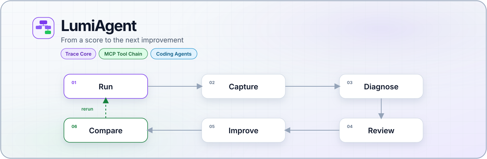

# LumiAgent



<div align="center">
  <p>
    <a href="#install"></a>
    <a href="#license"></a>
    <a href="#status"></a>
  </p>
  <p><strong>English</strong> · <a href="README.zh-CN.md">简体中文</a></p>
  <p>
    <a href="#try-it">Try it</a> ·
    <a href="#install">Install</a> ·
    <a href="#usage">Usage</a> ·
    <a href="#why-lumiagent">Why</a> ·
    <a href="#architecture">Architecture</a> ·
    <a href="#status">Status</a> ·
    <a href="#docs">Docs</a>
  </p>
</div>

**Agent Evaluation & Optimization Loop** — turn a pass/fail score into a path you can inspect and improve.

Benchmark scores say whether an agent succeeded. LumiAgent shows how the run unfolded, where failure formed, which spans support the diagnosis, and what is worth changing before the next rerun.

The first product line is **Coding Agents** and **MCP tool chains**: capture real execution, keep the evidence, review it, then compare the rerun.

| If you want to… | Jump to |
| --- | --- |
| See a real span tree in 30 seconds | [Try it](#try-it) |
| Record a Claude Code session | [Capture a Claude Code session](#capture-a-claude-code-session) |
| Record an MCP server call | [Capture an MCP tool call](#capture-an-mcp-tool-call) |
| Emit traces from Python | [Build a trace in Python](#build-a-trace-in-python) |

## Try it

Install once, then inspect a committed coding-agent trace. No Claude Code session required.

```bash
pip install -e ".[dev]"
python -m lumiagent.cli show tests/adapters/claude_code/fixtures/real_session_sanitized_trace.json --checks
```

`lumi` is the same CLI if it is on your `PATH`.


You should see a nested span tree: user prompt → context → edit → verification → workflow check.

`--checks` reports evidence quality for the current rules. Historical fixtures may show `unknown` until they are recaptured; that is expected after the Phase 4 evidence-readiness work.

## Install

Python **3.11+**.

```bash
pip install -e ".[dev]"
python -m lumiagent.cli --help
```

<details>
<summary>If the package is not installed in editable mode</summary>

Set the local source path, then use the module form:

```powershell
$env:PYTHONPATH = "src"
python -m lumiagent.cli --help
```

```bash
PYTHONPATH=src python -m lumiagent.cli --help
```

</details>

## Usage

### Capture a Claude Code session

Configure hooks for this project:

```powershell
$env:PYTHONPATH = "src"
python -m lumiagent.cli setup claude-code
```

The command prints hook activation for the current session:

| Status | Meaning |
| --- | --- |
| `active` | This session has written hook events. |
| `needs_reload` | Settings are in place; reload `/hooks` or restart the session. |
| `not_in_claude_code` | Runtime activation cannot be checked outside Claude Code. |

After hooks are active and at least one tool call has run:

```powershell
$env:PYTHONPATH = "src"
python -m lumiagent.cli setup claude-code --verify
python -m lumiagent.cli trace <session-id> -o .lumiagent/traces/<session-id>-raw.json
python -m lumiagent.cli show .lumiagent/traces/<session-id>-raw.json --checks
```

<details>
<summary>Optional transcript enrichment</summary>

Best-effort Claude Code transcript import can add semantic evidence such as the user prompt, task understanding, and final response:

```powershell
$env:PYTHONPATH = "src"
python -m lumiagent.cli trace <session-id> `
  --transcript-path C:\path\to\claude-code-session.jsonl `
  -o .lumiagent/traces/<session-id>-transcript-raw.json
```

</details>

### Capture an MCP tool call

```bash
PYTHONPATH=src python -m lumiagent.cli capture mcp \
  --transport stdio \
  --server-command "npx" \
  --server-arg "-y" \
  --server-arg "@modelcontextprotocol/server-filesystem" \
  --server-arg "$PWD" \
  --tool "read_file" \
  --arguments '{"path":"README.md"}' \
  -o ".lumiagent/traces/filesystem-read-success.json"

PYTHONPATH=src python -m lumiagent.cli show ".lumiagent/traces/filesystem-read-success.json"
```

Expected shape:

```text
Run: MCP capture npx.read_file
Status: success
- MCP Tool Chain
  - MCP Initialization
  - MCP Tool Discovery
  - MCP Tool Selection
  - MCP Tool Execution: read_file
```

<details>
<summary>Stable failure path: missing tool</summary>

```bash
PYTHONPATH=src python -m lumiagent.cli capture mcp \
  --transport stdio \
  --server-command "npx" \
  --server-arg "-y" \
  --server-arg "@modelcontextprotocol/server-filesystem" \
  --server-arg "$PWD" \
  --tool "read_me" \
  --arguments '{"path":"README.md"}' \
  -o ".lumiagent/traces/filesystem-tool-not-found.json"

PYTHONPATH=src python -m lumiagent.cli show ".lumiagent/traces/filesystem-tool-not-found.json"
```

</details>

### Build a trace in Python

```python
from lumiagent.tracing import SpanKind, TraceBuilder, to_json

builder = TraceBuilder(name="coding agent run", input_value={"task": "fix failing test"})

agent_span = builder.start_span("Coding Agent", kind=SpanKind.AGENT)
search_span = builder.start_span(
    "Search files",
    kind=SpanKind.TOOL,
    parent_span_id=agent_span,
    metadata={"operation": "file_search"},
)
builder.end_span(search_span, output={"matches": ["src/lumiagent/tracing/models.py"]})
builder.end_span(agent_span, output={"result": "trace captured"})

run = builder.build(output={"status": "done"})
print(to_json(run))
```

## Why LumiAgent

Agent systems are becoming more tool-heavy, but evaluation is often compressed into a final score. The score is necessary. It still cannot answer:

| Question | Score | LumiAgent |
| --- | --- | --- |
| Did the run succeed? | Yes | Yes, plus the span where it failed |
| How was context gathered? | No | Span tree + artifacts |
| Why this tool, with these arguments? | No | Selection, schema, and argument evidence |
| Were results used correctly? | No | Result-consumption evidence |
| Was verification enough? | No | Workflow checks |
| What should change next? | No | Diagnosis linked to evidence spans |

LumiAgent starts from a structured, replayable, evaluable trace, then builds the optimization loop around it.

## Architecture

Trace Core stays framework-agnostic. Claude Code, MCP, SDKs, CLI wrappers, and transcript importers sit on top as adapters.


[Interactive viewer](docs/assets/archify/runtime-architecture.html) · [All diagrams](docs/assets/archify/index.html)

The intended layering is `CaptureStrategy → Trace Core → view models (Phase 5) → visualization`. MCP and Coding Agent details live in adapter conventions, not as extra Core fields.

<details>
<summary>Stage diagrams</summary>

**Trace Core model**


[Interactive viewer](docs/assets/archify/trace-core-model.html) · Docs source: [`trace-core-model.mmd`](docs/diagrams/trace-core-model.mmd)

**Visualization intent**


[Interactive viewer](docs/assets/archify/visualization-intent.html) · Docs source: [`trace-core-visualization-intent.mmd`](docs/diagrams/trace-core-visualization-intent.mmd)

**MCP evidence layer**


[Interactive viewer](docs/assets/archify/mcp-evidence-layer.html) · Docs source: [`mcp-tool-chain-evidence-layer.mmd`](docs/diagrams/mcp-tool-chain-evidence-layer.mmd)

**MCP capture + display**


[Interactive viewer](docs/assets/archify/mcp-capture-display.html) · Docs source: [`mcp-capture-display-chain.mmd`](docs/diagrams/mcp-capture-display-chain.mmd)

**Coding Agent capture flow**


[Interactive viewer](docs/assets/archify/coding-agent-capture.html) · Docs source: [`coding-agent-capture-flow.mmd`](docs/diagrams/coding-agent-capture-flow.mmd)

</details>

## Status

| Capability | State |
| --- | --- |
| Trace Schema / Span Tree Core | Ready |
| MCP tool-chain evidence + stdio capture + `show` | Ready |
| Coding Agent model + Claude Code hooks + CLI viewer | Ready |
| P4-P evidence readiness, source ordering, legacy eval isolation | Ready |
| Evaluation / diagnosis engine | Next |
| Replay / visualization data | Planned |

MVP checklist:

- [x] Trace Schema / Span Tree Core
- [x] MCP Tool Chain evidence model
- [x] MCP capture + display (`CaptureStrategy`)
- [x] Coding Agent trace + Claude Code hooks + CLI viewer
- [x] P4-P: evidence readiness, source ordering, legacy eval isolation
- [ ] Evaluation / diagnosis (evidence fixes → task verification → skill-based eval → diagnosis → improvement reruns)
- [ ] Replay / visualization data preparation

P4-P is implemented and locally verified. Task execution, evaluation, diagnosis, and experiment engines are still pending. See the [Phase 4 spec](docs/specs/evaluation-diagnosis-engine.md) (Chinese) and the [implementation roadmap](docs/superpowers/plans/2026-09-15-phase4-implementation-roadmap.md). `lumi eval` prints migration guidance and exits 2; `lumi legacy-eval` keeps the deprecated chat scorer.

<details>
<summary>Shipped stage notes</summary>

**Trace Core** — nested Span Tree, events, artifacts, evaluation/diagnosis records with evidence span ids, stable enums, JSON round-trip, structural validation, `TraceBuilder`.

**MCP evidence** — adapter conventions under `src/lumiagent/adapters/mcp/`, `McpFailureType` taxonomy, schemas for schema snapshots, tool calls, execution, failures, and result consumption.

**MCP capture** — `CaptureStrategy`, stdio runtime, explicit tool selection (including `tool_not_found`), mapper to `AgentRun`, CLI `capture mcp` / `show`, verified against `@modelcontextprotocol/server-filesystem`.

**Coding Agent** — framework-agnostic conventions under `src/lumiagent/adapters/coding/`, Claude Code hook adapter, `setup claude-code`, `trace <session-id>`, optional transcript enrichment, deterministic workflow checks.

</details>

<details>
<summary>Later / non-goals</summary>

Later: capture SDK + MCP proxy, HTTP/SSE MCP runtime, Web UI, expert knowledge base, multi-agent visualization.

Not the current MVP: a generic LangSmith/Langfuse clone, a prompt platform, a generic RAG eval product, or a full multi-agent orchestration framework.

</details>

## Docs

| Topic | Spec | Report |
| --- | --- | --- |
| Trace Core | [spec](docs/specs/trace-core-mvp.md) | [report](docs/reports/trace-core-mvp-technical-report.zh-CN.md) |
| MCP evidence | [spec](docs/specs/mcp-tool-chain-model.md) | [report](docs/reports/mcp-tool-chain-model-technical-report.zh-CN.md) |
| MCP capture + display | [spec](docs/specs/mcp-capture-display-chain.md) | [report](docs/reports/mcp-capture-display-chain-technical-report.zh-CN.md) |
| Coding Agent trace | [spec](docs/specs/coding-agent-trace-model.md) | [report](docs/reports/coding-agent-trace-model-technical-report.zh-CN.md) |
| Evaluation / diagnosis | [spec](docs/specs/evaluation-diagnosis-engine.md) | [P4-P report](docs/reports/phase4-evidence-readiness-technical-report.zh-CN.md) |
| Architecture diagrams | [dual-track convention](docs/diagrams/README.md) | README Archify SVG + docs Mermaid |

## Development

```text
src/lumiagent/
  tracing/      Span Tree core
  capture/      CaptureStrategy
  adapters/     MCP, Coding Agent, Claude Code
  evaluation/   Phase 4 namespace (engine not shipped)
  cli.py        lumi / python -m lumiagent.cli
```

```bash
python -m pytest -v
python -m ruff check src/lumiagent/tracing src/lumiagent/adapters src/lumiagent/capture src/lumiagent/evaluation src/lumiagent/cli.py tests
python -m mypy src/lumiagent/tracing src/lumiagent/adapters src/lumiagent/capture src/lumiagent/evaluation
```

If the package is not installed in editable mode, set `PYTHONPATH=src` (PowerShell: `$env:PYTHONPATH = "src"`) first.

| Area | Technology |
| --- | --- |
| Language | Python 3.11+ |
| Data model | Pydantic v2 |
| CLI | Typer |
| MCP runtime | MCP Python SDK over stdio |
| Tests / lint / types | pytest, ruff, mypy |

<details>
<summary>Full tree (source, tests, docs)</summary>

```text
src/lumiagent/
├── capture/
├── adapters/
│   ├── mcp/
│   ├── coding/
│   └── claude_code/
├── cli.py
└── tracing/

tests/
├── capture/
├── adapters/
├── tracing/
├── test_cli.py
├── test_cli_mcp.py
├── test_cli_coding_trace.py
└── test_cli_claude_code_setup.py

docs/
├── assets/
├── diagrams/
├── reports/
└── specs/
```

</details>

## License

MIT
