# LumiAgent

[简体中文](README.zh-CN.md)

**Agent Evaluation & Optimization Loop**

LumiAgent turns agent evaluation from a score into a path to improvement.

Benchmark scores tell whether an agent succeeded. LumiAgent shows how the run unfolded, where failure emerged, what evidence supports the diagnosis, and which changes are most likely to improve the next run.

```text
run tasks → capture traces → diagnose failures → review evidence → apply improvements → compare reruns
```

The first product direction focuses on Coding Agents and MCP Tool Chains: LumiAgent records real agent execution traces, analyzes tool and workflow failures, helps humans review the evidence, and supports rerun comparison after improvements.

## Why LumiAgent

Agent systems are becoming more tool-heavy and workflow-heavy, but evaluation is often reduced to a final pass/fail score. That score is necessary, but it does not explain:

- how the agent gathered context
- why it selected a tool
- whether tool arguments matched the schema
- how it consumed tool results
- whether verification was sufficient
- which concrete spans support a diagnosis

LumiAgent starts from a structured, replayable, evaluable, and diagnosable trace model, then builds an optimization loop around it.

## Current Status

**Stage 1: Trace Core MVP — completed**

Implemented capabilities:

- Agent run model with nested Span Tree
- Span events and artifacts
- Evaluation and diagnosis records with evidence span references
- Stable enum values for run, span, event, artifact, target, and severity types
- JSON/dict serialization and round-trip loading
- Structural validation for span IDs, parent-child links, target references, and evidence spans
- Convenience `TraceBuilder` API
- Generic Agent and Coding Agent trace fixtures

**Stage 2: MCP Tool Chain Model — completed**

Implemented capabilities:

- MCP adapter/convention layer under `src/lumiagent/adapters/mcp/`
- Stable MCP span and artifact `metadata.type` conventions
- `McpFailureType` taxonomy outside the generic Trace Core
- Lightweight MCP evidence schemas for schema snapshots, tool calls, execution summaries, failures, and result consumption
- Builder helpers for MCP tool-chain spans, artifacts, results, and failure evidence
- Successful and failed MCP trace fixtures covering `argument_invalid`, `tool_execution_failed`, and `result_misinterpreted`

Product value:

- Preserves structured evidence for how an Agent discovers tools, sees schemas, generates arguments, executes MCP tools, and consumes results.
- Keeps MCP as an adapter evidence layer so Phase 3 Coding Agent Trace and Phase 4 Evaluation / Diagnosis can consume stable evidence without polluting the Core model.

Specifications and reports:

- [`docs/specs/mcp-tool-chain-model.md`](docs/specs/mcp-tool-chain-model.md)
- [`docs/reports/trace-core-mvp-technical-report.zh-CN.md`](docs/reports/trace-core-mvp-technical-report.zh-CN.md)
- [`docs/reports/mcp-tool-chain-model-technical-report.zh-CN.md`](docs/reports/mcp-tool-chain-model-technical-report.zh-CN.md)

## Quick Example

```python
from lumiagent.tracing import SpanKind, TraceBuilder, to_json

builder = TraceBuilder(name="coding agent run", input_value={"task": "fix failing test"})

agent_span = builder.start_span("Coding Agent", kind=SpanKind.AGENT)
search_span = builder.start_span(
    "Search files",
    kind=SpanKind.TOOL,
    parent_span_id=agent_span,
    metadata={"operation": "file_search"},
)
builder.end_span(search_span, output={"matches": ["src/lumiagent/tracing/models.py"]})
builder.end_span(agent_span, output={"result": "trace captured"})

run = builder.build(output={"status": "done"})
print(to_json(run))
```

## Architecture



Mermaid source: [`docs/diagrams/trace-core-model.mmd`](docs/diagrams/trace-core-model.mmd)



Mermaid source: [`docs/diagrams/mcp-tool-chain-evidence-layer.mmd`](docs/diagrams/mcp-tool-chain-evidence-layer.mmd)

The trace core is intentionally independent from any single agent framework. Coding Agent support, MCP Tool Chain capture, SDK hooks, CLI wrappers, and transcript importers should be built as adapters on top of the core model.

The MCP Tool Chain layer is an adapter evidence layer: it records tool discovery, schema snapshots, argument generation, permission, execution results, failure evidence, and result consumption without adding MCP-specific fields to the Trace Core.

## Roadmap

### MVP Phases (Near-term)

- [x] Trace Schema / Span Tree Core
- [x] MCP Tool Chain evidence model
- [ ] MCP Capture + Display chain (unified `CaptureStrategy` entry point)
- [ ] Coding Agent trace model + Claude Code hooks capture + CLI viewer
- [ ] Evaluation / Diagnosis Agent (built on LumiAgent's own agent infrastructure)
- [ ] Replay / Visualization data preparation

### Future Phases

- [ ] Capture SDK + MCP Proxy
- [ ] Web UI
- [ ] Expert Knowledge Base + Advanced Diagnosis
- [ ] Multi-Agent Visualization + Performance

Non-goals for the current MVP:

- Generic LangSmith/Langfuse clone
- Prompt management platform
- Generic RAG evaluation platform
- Full multi-agent orchestration framework

## Project Structure

```text
src/lumiagent/
├── adapters/
│   └── mcp/
│       ├── __init__.py
│       ├── builder.py
│       ├── conventions.py
│       ├── schemas.py
│       └── taxonomy.py
└── tracing/
    ├── __init__.py
    ├── builder.py
    ├── enums.py
    ├── models.py
    ├── serializer.py
    └── validator.py

tests/
├── adapters/mcp/
│   ├── fixtures/
│   ├── test_fixtures.py
│   ├── test_mcp_builder.py
│   ├── test_schemas.py
│   └── test_taxonomy.py
└── tracing/
    ├── fixtures/
    ├── test_builder.py
    ├── test_models.py
    ├── test_serializer.py
    └── test_validator.py

docs/
├── reports/
│   ├── trace-core-mvp-technical-report.zh-CN.md
│   └── mcp-tool-chain-model-technical-report.zh-CN.md
└── specs/
    └── mcp-tool-chain-model.md
```

## Installation

```bash
pip install -e ".[dev]"
```

Python 3.11+ is required.

## Verification

```bash
python -m pytest -v
python -m ruff check src/lumiagent/tracing src/lumiagent/adapters tests/tracing tests/adapters
python -m mypy src/lumiagent/tracing src/lumiagent/adapters
```

If the package is not installed in editable mode, run the checks with the local source path:

```powershell
$env:PYTHONPATH = "src"
python -m pytest -v
python -m ruff check src/lumiagent/tracing src/lumiagent/adapters tests/tracing tests/adapters
python -m mypy src/lumiagent/tracing src/lumiagent/adapters
```

## Tech Stack

| Area | Technology |
| --- | --- |
| Language | Python 3.11+ |
| Data Model | Pydantic v2 |
| Testing | pytest |
| Linting | ruff |
| Type Checking | mypy |

## License

MIT
