# LumiAgent

[English](README.md)

**Agent 评测与优化闭环**

LumiAgent 将 Agent 评测从一个分数，推进为一条可执行的改进路径。

Benchmark 能回答 Agent 是否成功，LumiAgent 进一步回答：执行过程如何展开，失败在哪一步形成，诊断依据来自哪些证据，以及下一轮最值得优化什么。

```text
运行任务 → 采集轨迹 → 诊断失败 → 审阅证据 → 应用改进 → 对比复跑
```

首个产品方向聚焦 Coding Agent 与 MCP Tool Chain：LumiAgent 记录真实 Agent 执行轨迹，分析工具链与工作流失败，辅助人工审阅证据，并支持优化后的复跑对比。

## 为什么需要 LumiAgent

Agent 系统正在变得越来越依赖工具和工作流，但评测经常被压缩成最终的 pass/fail 分数。这个分数是必要的，但它无法解释：

- Agent 如何收集上下文
- Agent 为什么选择某个工具
- 工具参数是否符合 schema
- Agent 如何使用工具返回结果
- 验证步骤是否充分
- 诊断结论具体由哪些 span 提供证据

LumiAgent 从结构化、可回放、可评测、可诊断的 trace 模型出发，在此之上构建 Agent 优化闭环。

## 当前状态

**第一阶段：Trace Core MVP — 已完成**

已实现能力：

- 支持嵌套 Span Tree 的 Agent Run 模型
- Span 事件与产物记录
- 支持 evidence span 引用的 Evaluation 与 Diagnosis 记录
- 稳定的 run、span、event、artifact、target、severity 枚举值
- JSON/dict 序列化与反序列化
- span ID、父子关系、target 引用、evidence span 引用的结构校验
- 便捷构造 API：`TraceBuilder`
- 通用 Agent 与 Coding Agent trace fixture

**第二阶段 A：MCP Tool Chain Evidence Model — 已完成**

已实现能力：

- `src/lumiagent/adapters/mcp/` 下的 MCP adapter/convention 层
- 稳定的 MCP span 与 artifact `metadata.type` 约定
- 位于通用 Trace Core 之外的 `McpFailureType` taxonomy
- 面向 schema snapshot、tool call、execution summary、failure evidence、result consumption 的轻量 MCP evidence schema
- 用于 MCP tool-chain span、artifact、result 和 failure evidence 的 builder helpers
- 成功和失败 MCP trace fixtures，覆盖 `argument_invalid`、`tool_execution_failed`、`result_misinterpreted`

产品价值：

- 保留 Agent 如何发现工具、看到 schema、生成参数、执行 MCP 工具、消费结果的结构化证据。
- 将 MCP 保持为 adapter evidence layer，使后续 Coding Agent Trace 与 Evaluation / Diagnosis 可以消费稳定证据，同时不污染 Core 模型。

**第二阶段 B：MCP Capture + Display Chain — 已完成**

已实现能力：

- 作为统一采集入口的通用 `CaptureStrategy` protocol
- transport-agnostic `McpClientRuntime` protocol 与 stdio `StdioMcpClientRuntime`
- 显式工具选择，并记录成功选择与 `tool_not_found` 失败证据
- `McpCaptureStrategy` 编排连接、初始化、工具发现、工具选择、工具执行和 trace mapping
- `McpTraceMapper` 将真实 MCP runtime 输出转换为合法 `AgentRun` trace
- CLI 命令：`lumiagent capture mcp` 与 `lumiagent show`
- CLI viewer 展示 span tree、工具选择、参数、结果、失败和 evidence span
- 使用 `@modelcontextprotocol/server-filesystem` 的第三方 filesystem MCP 验证路径

产品价值：

- 打通首个真实第三方 MCP Server 的 capture-model-display 闭环。
- 记录 MCP 工具链失败发生的位置：连接、初始化、发现、选择、参数生成、执行、超时、transport、结果结构或结果消费。
- 将 stdio transport 细节留在 adapter runtime 中，同时为后续 HTTP/SSE runtime、Coding Agent hooks、replay 和 diagnosis 保持稳定 trace shape。

**第三阶段：Coding Agent Trace Model — 已完成**

已实现能力：

- `src/lumiagent/adapters/coding/` 下的框架无关 Coding Agent conventions
- 面向 coding workflow 的 action evidence 与 semantic evidence schema
- 用于增量 hook-to-trace 构建的最小 `BuilderTraceWriter`
- `src/lumiagent/adapters/claude_code/` 下的 Claude Code hooks 采集 adapter
- `lumiagent setup claude-code` 与 `--verify` 提供 hook setup 和 activation 检查
- `lumiagent trace <session-id>` 将 hook events 转换为 `AgentRun`
- 可选的 best-effort Claude Code transcript enrichment
- 针对验证缺失、失败命令恢复、权限拒绝和未解决错误的 deterministic workflow checks
- Coding Agent CLI viewer 输出 semantic summary、span tree 和 `--checks`
- synthetic coding fixtures 与 sanitized real Claude Code session fixture

产品价值：

- 采集 Coding Agent 如何从用户请求进入上下文收集、代码修改、验证、失败恢复和最终回复。
- 将稳定 Coding Agent 语义与 Claude Code 专属 hook payload 分离。
- 生成可人工审阅的 workflow evidence，同时不越界到 Phase 4 evaluation / diagnosis。

规格与报告：

- [`docs/specs/trace-core-mvp.md`](docs/specs/trace-core-mvp.md)
- [`docs/specs/mcp-tool-chain-model.md`](docs/specs/mcp-tool-chain-model.md)
- [`docs/specs/mcp-capture-display-chain.md`](docs/specs/mcp-capture-display-chain.md)
- [`docs/specs/coding-agent-trace-model.md`](docs/specs/coding-agent-trace-model.md)
- [`docs/reports/trace-core-mvp-technical-report.zh-CN.md`](docs/reports/trace-core-mvp-technical-report.zh-CN.md)
- [`docs/reports/mcp-tool-chain-model-technical-report.zh-CN.md`](docs/reports/mcp-tool-chain-model-technical-report.zh-CN.md)
- [`docs/reports/mcp-capture-display-chain-technical-report.zh-CN.md`](docs/reports/mcp-capture-display-chain-technical-report.zh-CN.md)
- [`docs/reports/coding-agent-trace-model-technical-report.zh-CN.md`](docs/reports/coding-agent-trace-model-technical-report.zh-CN.md)

## 快速示例

### 采集并查看 Claude Code coding session

为当前项目配置 Claude Code hooks：

```powershell
$env:PYTHONPATH = "src"
python -m lumiagent.cli setup claude-code
```

setup 命令会输出当前 Claude Code session 的 hooks activation 状态：

- `active`：当前 session 已写入 hook events。
- `needs_reload`：settings 已配置，但当前运行中的 session 需要打开 `/hooks` 热加载或重启。
- `not_in_claude_code`：不在 Claude Code 中运行，无法检查运行时 activation。

hooks 激活并触发过工具调用后，转换并查看 session trace：

```powershell
$env:PYTHONPATH = "src"
python -m lumiagent.cli setup claude-code --verify
python -m lumiagent.cli trace <session-id> -o .lumiagent/traces/<session-id>-raw.json
python -m lumiagent.cli show .lumiagent/traces/<session-id>-raw.json --checks
```

输出形态示例：

```text
Run: Claude Code session <session-id>
Status: success
Semantic Summary
Span Tree
- Coding Agent Run  type=coding_agent_run
  - Context Gathering  type=context_gathering
  - Edit code  type=code_edit
  - Verification  type=verification
  - Workflow Check  type=workflow_check
Workflow Checks
  status: pass
```

可选的 transcript enrichment 可以补充用户请求、任务理解、最终回复等 semantic evidence：

```powershell
$env:PYTHONPATH = "src"
python -m lumiagent.cli trace <session-id> `
  --transcript-path C:\path\to\claude-code-session.jsonl `
  -o .lumiagent/traces/<session-id>-transcript-raw.json
```

### 用代码构造 trace

```python
from lumiagent.tracing import SpanKind, TraceBuilder, to_json

builder = TraceBuilder(name="coding agent run", input_value={"task": "fix failing test"})

agent_span = builder.start_span("Coding Agent", kind=SpanKind.AGENT)
search_span = builder.start_span(
    "Search files",
    kind=SpanKind.TOOL,
    parent_span_id=agent_span,
    metadata={"operation": "file_search"},
)
builder.end_span(search_span, output={"matches": ["src/lumiagent/tracing/models.py"]})
builder.end_span(agent_span, output={"result": "trace captured"})

run = builder.build(output={"status": "done"})
print(to_json(run))
```

### 采集并查看真实 MCP 工具调用

```bash
PYTHONPATH=src python -m lumiagent.cli capture mcp \
  --transport stdio \
  --server-command "npx" \
  --server-arg "-y" \
  --server-arg "@modelcontextprotocol/server-filesystem" \
  --server-arg "$PWD" \
  --tool "read_file" \
  --arguments '{"path":"README.md"}' \
  -o ".lumiagent/traces/filesystem-read-success.json"

PYTHONPATH=src python -m lumiagent.cli show ".lumiagent/traces/filesystem-read-success.json"
```

输出形态示例：

```text
Run: MCP capture npx.read_file
Status: success
- MCP Tool Chain
  - MCP Initialization
  - MCP Tool Discovery
  - MCP Tool Selection
  - MCP Tool Execution: read_file
Tool Selection
  requested: read_file
  selected: read_file
```

也可以通过请求不存在的工具稳定生成失败 trace：

```bash
PYTHONPATH=src python -m lumiagent.cli capture mcp \
  --transport stdio \
  --server-command "npx" \
  --server-arg "-y" \
  --server-arg "@modelcontextprotocol/server-filesystem" \
  --server-arg "$PWD" \
  --tool "read_me" \
  --arguments '{"path":"README.md"}' \
  -o ".lumiagent/traces/filesystem-tool-not-found.json"

PYTHONPATH=src python -m lumiagent.cli show ".lumiagent/traces/filesystem-tool-not-found.json"
```

## 架构


Mermaid 源文件：[`docs/diagrams/trace-core-model.mmd`](docs/diagrams/trace-core-model.mmd)


Mermaid 源文件：[`docs/diagrams/trace-core-visualization-intent.mmd`](docs/diagrams/trace-core-visualization-intent.mmd)


Mermaid 源文件：[`docs/diagrams/mcp-tool-chain-evidence-layer.mmd`](docs/diagrams/mcp-tool-chain-evidence-layer.mmd)


Mermaid 源文件：[`docs/diagrams/mcp-capture-display-chain.mmd`](docs/diagrams/mcp-capture-display-chain.mmd)



Mermaid 源文件：[`docs/diagrams/coding-agent-capture-flow.mmd`](docs/diagrams/coding-agent-capture-flow.mmd)

Trace Core 刻意保持与具体 Agent 框架解耦。Coding Agent 支持、MCP Tool Chain 捕获、SDK hooks、CLI wrappers 和 transcript importers 都应作为核心模型之上的适配层实现。

Trace Core 数据也通过清晰分层服务未来可视化：`CaptureStrategy → Trace Core → view models（Phase 5）→ 可视化界面`。CLI Viewer 从 Stage 2b 起就消费这层数据，Web UI 在后续阶段跟进；Run Summary、Timeline、Span Tree、Span Detail、Artifact Viewer、Evaluation/Diagnosis Panel、Trace Diff 和 Experiment 对比都应优先从稳定 Core primitives 或 view models 推导，只有通用、稳定、跨视图重复需要的字段才提升进 Core。

MCP Tool Chain 层是 adapter evidence layer：它记录工具发现、schema snapshot、参数生成、权限、执行结果、失败证据、结果消费和真实 stdio capture，同时不向 Trace Core 添加 MCP 专用字段。

## 路线图

### MVP 阶段（近期）

- [x] Trace Schema / Span Tree Core
- [x] MCP Tool Chain evidence model
- [x] MCP 采集 + 展示链（统一 `CaptureStrategy` 入口）
- [x] Coding Agent trace model + Claude Code hooks 采集 + CLI Viewer
- [ ] Evaluation / Diagnosis Agent（基于 LumiAgent 自身 Agent 基础设施）
- [ ] Replay / Visualization 数据准备

### 未来阶段

- [ ] 采集 SDK + MCP Proxy
- [ ] HTTP/SSE MCP runtime 支持
- [ ] Web UI
- [ ] 专家知识库 + 高级诊断
- [ ] 多 Agent 可视化 + 性能优化

当前 MVP 的非目标：

- 通用 LangSmith/Langfuse 克隆
- Prompt 管理平台
- 通用 RAG 评估平台
- 完整多 Agent 编排框架

## 项目结构

```text
src/lumiagent/
├── capture/
│   ├── __init__.py
│   └── strategy.py
├── adapters/
│   ├── mcp/
│   │   ├── capture.py
│   │   ├── runtime.py
│   │   ├── selector.py
│   │   ├── mapper.py
│   │   ├── viewer.py
│   │   ├── builder.py
│   │   ├── conventions.py
│   │   ├── schemas.py
│   │   └── taxonomy.py
│   ├── coding/
│   │   ├── conventions.py
│   │   ├── events.py
│   │   ├── normalizer.py
│   │   ├── validator.py
│   │   └── viewer.py
│   └── claude_code/
│       ├── hooks.py
│       ├── setup.py
│       ├── events.py
│       ├── transcript.py
│       ├── converter.py
│       └── sanitizer.py
├── cli.py
└── tracing/
    ├── __init__.py
    ├── builder.py
    ├── builder_writer.py
    ├── enums.py
    ├── models.py
    ├── serializer.py
    ├── validator.py
    └── writer.py

tests/
├── capture/
│   └── test_strategy.py
├── adapters/
│   ├── mcp/
│   ├── coding/
│   │   └── fixtures/
│   └── claude_code/
│       └── fixtures/
├── test_cli.py
├── test_cli_mcp.py
├── test_cli_coding_trace.py
├── test_cli_claude_code_setup.py
└── tracing/
    ├── fixtures/
    ├── test_builder.py
    ├── test_builder_writer.py
    ├── test_models.py
    ├── test_serializer.py
    ├── test_validator.py
    └── test_writer.py

docs/
├── assets/
│   ├── trace-core-model.svg
│   ├── trace-core-visualization-intent.svg
│   ├── mcp-tool-chain-evidence-layer.svg
│   ├── mcp-capture-display-chain.svg
│   └── coding-agent-capture-flow.svg
├── diagrams/
│   ├── trace-core-model.mmd
│   ├── trace-core-visualization-intent.mmd
│   ├── mcp-tool-chain-evidence-layer.mmd
│   ├── mcp-capture-display-chain.mmd
│   └── coding-agent-capture-flow.mmd
├── reports/
│   ├── trace-core-mvp-technical-report.zh-CN.md
│   ├── mcp-tool-chain-model-technical-report.zh-CN.md
│   ├── mcp-capture-display-chain-technical-report.zh-CN.md
│   └── coding-agent-trace-model-technical-report.zh-CN.md
└── specs/
    ├── trace-core-mvp.md
    ├── mcp-tool-chain-model.md
    ├── mcp-capture-display-chain.md
    └── coding-agent-trace-model.md
```

## 安装

```bash
pip install -e ".[dev]"
```

要求 Python 3.11+。

## 验证

```bash
python -m pytest -v
python -m ruff check src/lumiagent/tracing src/lumiagent/adapters src/lumiagent/capture tests/tracing tests/adapters tests/capture tests/test_cli_mcp.py
python -m mypy src/lumiagent/tracing src/lumiagent/adapters src/lumiagent/capture
```

如果当前环境没有以 editable mode 安装本项目，可以使用本地源码路径运行：

```powershell
$env:PYTHONPATH = "src"
python -m pytest -v
python -m ruff check src/lumiagent/tracing src/lumiagent/adapters src/lumiagent/capture tests/tracing tests/adapters tests/capture tests/test_cli_mcp.py
python -m mypy src/lumiagent/tracing src/lumiagent/adapters src/lumiagent/capture
```

## 技术栈

| 领域 | 技术 |
| --- | --- |
| 语言 | Python 3.11+ |
| 数据模型 | Pydantic v2 |
| CLI | Typer |
| MCP Runtime | MCP Python SDK over stdio |
| 测试 | pytest |
| Lint | ruff |
| 类型检查 | mypy |

## 许可证

MIT
