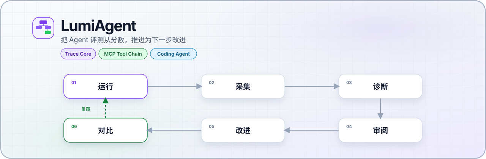
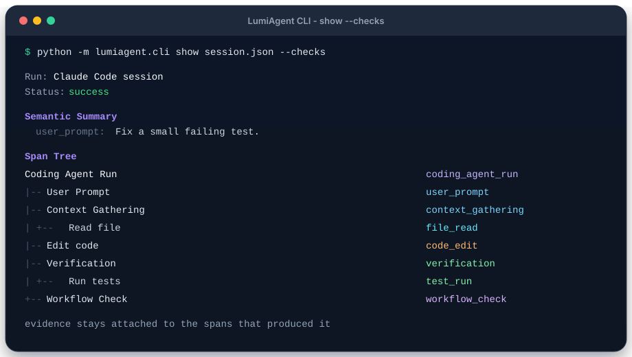

# LumiAgent



<div align="center">
  <p>
    <a href="#安装"></a>
    <a href="#许可证"></a>
    <a href="#当前状态"></a>
  </p>
  <p><a href="README.md">English</a> · <strong>简体中文</strong></p>
  <p>
    <a href="#先看一条轨迹">先试</a> ·
    <a href="#安装">安装</a> ·
    <a href="#使用">使用</a> ·
    <a href="#为什么需要-lumiagent">为什么</a> ·
    <a href="#架构">架构</a> ·
    <a href="#当前状态">状态</a> ·
    <a href="#文档">文档</a>
  </p>
</div>

**Agent 评测与优化闭环** — 把 pass/fail 分数，变成一条可以审阅、可以改进的路径。

Benchmark 能回答 Agent 是否成功。LumiAgent 继续回答：执行过程如何展开，失败在哪一步形成，诊断依据来自哪些 span，以及下一轮最值得改什么。

首个产品方向是 **Coding Agent** 与 **MCP 工具链**：记录真实执行，保留证据，辅助审阅，并支持优化后的复跑对比。

| 如果你想… | 从这里开始 |
| --- | --- |
| 30 秒看清一条真实 Span Tree | [先看一条轨迹](#先看一条轨迹) |
| 采集 Claude Code session | [采集 Claude Code session](#采集-claude-code-session) |
| 采集一次 MCP 工具调用 | [采集一次 MCP 工具调用](#采集一次-mcp-工具调用) |
| 用 Python 构造 trace | [用 Python 构造 trace](#用-python-构造-trace) |

## 先看一条轨迹

安装一次，即可查看仓库里已提交的 coding-agent trace，不需要先跑 Claude Code。

```bash
pip install -e ".[dev]"
python -m lumiagent.cli show tests/adapters/claude_code/fixtures/real_session_sanitized_trace.json --checks
```

若 `lumi` 已在 `PATH` 上，它与 `python -m lumiagent.cli` 等价。



你应看到嵌套的 span tree：用户请求 → 上下文收集 → 改代码 → 验证 → workflow check。

`--checks` 按当前规则报告证据质量。历史 fixture 可能显示 `unknown`，这是 P4-P 证据就绪之后的预期行为，需要重新采集才会变成当前规则下的结果。

## 安装

需要 Python **3.11+**。

```bash
pip install -e ".[dev]"
python -m lumiagent.cli --help
```

<details>
<summary>如果没有以 editable mode 安装</summary>

先设置本地源码路径，再使用模块入口：

```powershell
$env:PYTHONPATH = "src"
python -m lumiagent.cli --help
```

```bash
PYTHONPATH=src python -m lumiagent.cli --help
```

</details>

## 使用

### 采集 Claude Code session

为当前项目配置 hooks：

```powershell
$env:PYTHONPATH = "src"
python -m lumiagent.cli setup claude-code
```

命令会打印当前 session 的 hook 激活状态：

| 状态 | 含义 |
| --- | --- |
| `active` | 当前 session 已写入 hook events。 |
| `needs_reload` | settings 已配置，需要 `/hooks` 热加载或重启 session。 |
| `not_in_claude_code` | 不在 Claude Code 中，无法检查运行时激活状态。 |

hooks 激活并至少发生过一次工具调用后：

```powershell
$env:PYTHONPATH = "src"
python -m lumiagent.cli setup claude-code --verify
python -m lumiagent.cli trace <session-id> -o .lumiagent/traces/<session-id>-raw.json
python -m lumiagent.cli show .lumiagent/traces/<session-id>-raw.json --checks
```

<details>
<summary>可选：transcript enrichment</summary>

best-effort 导入 Claude Code transcript，可补充用户请求、任务理解、最终回复等 semantic evidence：

```powershell
$env:PYTHONPATH = "src"
python -m lumiagent.cli trace <session-id> `
  --transcript-path C:\path\to\claude-code-session.jsonl `
  -o .lumiagent/traces/<session-id>-transcript-raw.json
```

</details>

### 采集一次 MCP 工具调用

```bash
PYTHONPATH=src python -m lumiagent.cli capture mcp \
  --transport stdio \
  --server-command "npx" \
  --server-arg "-y" \
  --server-arg "@modelcontextprotocol/server-filesystem" \
  --server-arg "$PWD" \
  --tool "read_file" \
  --arguments '{"path":"README.md"}' \
  -o ".lumiagent/traces/filesystem-read-success.json"

PYTHONPATH=src python -m lumiagent.cli show ".lumiagent/traces/filesystem-read-success.json"
```

预期形态：

```text
Run: MCP capture npx.read_file
Status: success
- MCP Tool Chain
  - MCP Initialization
  - MCP Tool Discovery
  - MCP Tool Selection
  - MCP Tool Execution: read_file
```

<details>
<summary>稳定失败路径：工具不存在</summary>

```bash
PYTHONPATH=src python -m lumiagent.cli capture mcp \
  --transport stdio \
  --server-command "npx" \
  --server-arg "-y" \
  --server-arg "@modelcontextprotocol/server-filesystem" \
  --server-arg "$PWD" \
  --tool "read_me" \
  --arguments '{"path":"README.md"}' \
  -o ".lumiagent/traces/filesystem-tool-not-found.json"

PYTHONPATH=src python -m lumiagent.cli show ".lumiagent/traces/filesystem-tool-not-found.json"
```

</details>

### 用 Python 构造 trace

```python
from lumiagent.tracing import SpanKind, TraceBuilder, to_json

builder = TraceBuilder(name="coding agent run", input_value={"task": "fix failing test"})

agent_span = builder.start_span("Coding Agent", kind=SpanKind.AGENT)
search_span = builder.start_span(
    "Search files",
    kind=SpanKind.TOOL,
    parent_span_id=agent_span,
    metadata={"operation": "file_search"},
)
builder.end_span(search_span, output={"matches": ["src/lumiagent/tracing/models.py"]})
builder.end_span(agent_span, output={"result": "trace captured"})

run = builder.build(output={"status": "done"})
print(to_json(run))
```

## 为什么需要 LumiAgent

Agent 系统越来越依赖工具和工作流，但评测经常被压成最终分数。分数是必要的，它仍然无法回答：

| 问题 | 分数 | LumiAgent |
| --- | --- | --- |
| 这次 run 成功了吗？ | 能 | 能，并且能指出失败发生在哪个 span |
| 上下文是怎么收集的？ | 不能 | Span Tree + artifacts |
| 为什么选这个工具、这些参数？ | 不能 | 选择、schema 与参数证据 |
| 工具结果有没有被正确使用？ | 不能 | 结果消费证据 |
| 验证够不够？ | 不能 | Workflow checks |
| 下一轮该改什么？ | 不能 | 带 evidence span 的诊断 |

LumiAgent 从结构化、可回放、可评测的 trace 出发，再围绕它构建优化闭环。

## 架构

Trace Core 刻意与具体 Agent 框架解耦。Claude Code、MCP、SDK、CLI wrapper、transcript importer 都作为适配层坐在 Core 之上。



[交互查看](docs/assets/archify/runtime-architecture.html) · [全部架构图](docs/assets/archify/index.html)

分层约定是 `CaptureStrategy → Trace Core → view models（Phase 5）→ 可视化`。MCP 与 Coding Agent 细节放在 adapter conventions 中，不向 Core 增加专用字段。

<details>
<summary>阶段架构图</summary>

**Trace Core 模型**


[交互查看](docs/assets/archify/trace-core-model.html) · 文档源：[`trace-core-model.mmd`](docs/diagrams/trace-core-model.mmd)

**可视化意图**


[交互查看](docs/assets/archify/visualization-intent.html) · 文档源：[`trace-core-visualization-intent.mmd`](docs/diagrams/trace-core-visualization-intent.mmd)

**MCP 证据层**



[交互查看](docs/assets/archify/mcp-evidence-layer.html) · 文档源：[`mcp-tool-chain-evidence-layer.mmd`](docs/diagrams/mcp-tool-chain-evidence-layer.mmd)

**MCP 采集 + 展示**


[交互查看](docs/assets/archify/mcp-capture-display.html) · 文档源：[`mcp-capture-display-chain.mmd`](docs/diagrams/mcp-capture-display-chain.mmd)

**Coding Agent 采集流**


[交互查看](docs/assets/archify/coding-agent-capture.html) · 文档源：[`coding-agent-capture-flow.mmd`](docs/diagrams/coding-agent-capture-flow.mmd)

</details>

## 当前状态

| 能力 | 状态 |
| --- | --- |
| Trace Schema / Span Tree Core | 已就绪 |
| MCP 工具链证据 + stdio 采集 + `show` | 已就绪 |
| Coding Agent 模型 + Claude Code hooks + CLI viewer | 已就绪 |
| P4-P 证据就绪、源时序、legacy eval 隔离 | 已就绪 |
| Evaluation / diagnosis engine | 下一步 |
| Replay / 可视化数据 | 规划中 |

MVP 清单：

- [x] Trace Schema / Span Tree Core
- [x] MCP Tool Chain evidence model
- [x] MCP 采集 + 展示（`CaptureStrategy`）
- [x] Coding Agent trace + Claude Code hooks + CLI viewer
- [x] P4-P：证据就绪、源时序与 legacy eval 隔离
- [ ] Evaluation / diagnosis（证据修复 → 任务验证 → 技能化评测 → 诊断 → 改进复跑）
- [ ] Replay / Visualization 数据准备

P4-P 已实现并完成本地验收。任务执行、正式评测、诊断和实验引擎仍待实施。详见 [Phase 4 规格](docs/specs/evaluation-diagnosis-engine.md) 与 [实施路线图](docs/superpowers/plans/2026-09-15-phase4-implementation-roadmap.md)。`lumi eval` 仅提示迁移并退出 2；遗留聊天评分使用 `lumi legacy-eval`。

<details>
<summary>已交付阶段说明</summary>

**Trace Core** — 嵌套 Span Tree、事件、产物、带 evidence span 引用的 Evaluation / Diagnosis、稳定枚举、JSON 往返、结构校验、`TraceBuilder`。

**MCP evidence** — `src/lumiagent/adapters/mcp/` 下的 adapter 约定、`McpFailureType` taxonomy，以及 schema snapshot、tool call、execution、failure、result consumption 的 schema。

**MCP capture** — `CaptureStrategy`、stdio runtime、显式工具选择（含 `tool_not_found`）、映射为 `AgentRun`、CLI `capture mcp` / `show`，并用 `@modelcontextprotocol/server-filesystem` 验证。

**Coding Agent** — `src/lumiagent/adapters/coding/` 下的框架无关约定、Claude Code hook adapter、`setup claude-code`、`trace <session-id>`、可选 transcript enrichment、deterministic workflow checks。

</details>

<details>
<summary>后续方向 / 非目标</summary>

后续：采集 SDK + MCP Proxy、HTTP/SSE MCP runtime、Web UI、专家知识库、多 Agent 可视化。

当前 MVP 不做：通用 LangSmith/Langfuse 克隆、Prompt 管理平台、通用 RAG 评测产品、完整多 Agent 编排框架。

</details>

## 文档

| 主题 | 规格 | 报告 |
| --- | --- | --- |
| Trace Core | [规格](docs/specs/trace-core-mvp.md) | [报告](docs/reports/trace-core-mvp-technical-report.zh-CN.md) |
| MCP 证据 | [规格](docs/specs/mcp-tool-chain-model.md) | [报告](docs/reports/mcp-tool-chain-model-technical-report.zh-CN.md) |
| MCP 采集 + 展示 | [规格](docs/specs/mcp-capture-display-chain.md) | [报告](docs/reports/mcp-capture-display-chain-technical-report.zh-CN.md) |
| Coding Agent trace | [规格](docs/specs/coding-agent-trace-model.md) | [报告](docs/reports/coding-agent-trace-model-technical-report.zh-CN.md) |
| Evaluation / diagnosis | [规格](docs/specs/evaluation-diagnosis-engine.md) | [P4-P 报告](docs/reports/phase4-evidence-readiness-technical-report.zh-CN.md) |
| 架构图 | [双轨约定](docs/diagrams/README.md) | README 用 Archify SVG，docs 用 Mermaid |

## 开发

```text
src/lumiagent/
  tracing/      Span Tree 核心
  capture/      CaptureStrategy
  adapters/     MCP、Coding Agent、Claude Code
  evaluation/   Phase 4 命名空间（引擎尚未交付）
  cli.py        lumi / python -m lumiagent.cli
```

```bash
python -m pytest -v
python -m ruff check src/lumiagent/tracing src/lumiagent/adapters src/lumiagent/capture src/lumiagent/evaluation src/lumiagent/cli.py tests
python -m mypy src/lumiagent/tracing src/lumiagent/adapters src/lumiagent/capture src/lumiagent/evaluation
```

如果没有以 editable mode 安装，请先设置 `PYTHONPATH=src`（PowerShell：`$env:PYTHONPATH = "src"`）。

| 领域 | 技术 |
| --- | --- |
| 语言 | Python 3.11+ |
| 数据模型 | Pydantic v2 |
| CLI | Typer |
| MCP runtime | MCP Python SDK over stdio |
| 测试 / lint / 类型 | pytest、ruff、mypy |

<details>
<summary>完整目录（源码、测试、文档）</summary>

```text
src/lumiagent/
├── capture/
├── adapters/
│   ├── mcp/
│   ├── coding/
│   └── claude_code/
├── cli.py
└── tracing/

tests/
├── capture/
├── adapters/
├── tracing/
├── test_cli.py
├── test_cli_mcp.py
├── test_cli_coding_trace.py
└── test_cli_claude_code_setup.py

docs/
├── assets/
├── diagrams/
├── reports/
└── specs/
```

</details>

## 许可证

MIT
