# LumiAgent - 架构设计文档

## 1. 设计思路

### 1.1 核心理念

LumiAgent 采用 **分层解耦 + 插件化** 架构，将系统分为 6 个独立层次：



Mermaid 源文件：[`docs/diagrams/legacy-layered-architecture.mmd`](diagrams/legacy-layered-architecture.mmd)

### 1.2 设计原则

| 原则 | 说明 |
|------|------|
| **接口先行** | 每层定义抽象接口（Protocol），实现可替换 |
| **消息驱动** | 跨层通信通过统一消息格式，异步事件驱动 |
| **插件化** | 平台适配器、LLM Provider、工具均可热插拔 |
| **可观测** | 全链路 Trace，结构化日志，指标采集 |
| **可评估** | 内置评估框架，CI 级别自动化测试 Agent 能力 |

---

## 2. 模块详细设计

### 2.1 Platform Layer - 多平台适配层

#### 设计思路
采用 **Adapter 模式**，每个平台实现统一的 `PlatformAdapter` 接口。平台层只负责协议转换——将平台原生消息转为内部统一消息格式，将 Agent 回复转为平台原生格式发出。

#### 统一消息协议

```python
@dataclass
class UnifiedMessage:
    id: str                          # 消息唯一ID
    platform: str                    # 来源平台: cmd/wechat/feishu/dingtalk/web
    channel_id: str                  # 会话/群组 ID
    user_id: str                     # 发送者 ID
    user_name: str                   # 发送者昵称
    content: MessageContent          # 消息内容（支持多模态）
    message_type: MessageType        # text/image/file/audio/card/...
    reply_to: Optional[str]          # 回复引用的消息ID
    metadata: dict                   # 平台特有的额外信息
    timestamp: float                 # 消息时间戳

@dataclass
class MessageContent:
    text: Optional[str]              # 文本内容
    images: List[ImageData]          # 图片列表
    files: List[FileData]            # 文件列表
    audio: Optional[AudioData]       # 音频
    cards: Optional[CardData]        # 卡片消息（飞书/钉钉）

class PlatformAdapter(Protocol):
    """平台适配器接口"""
    platform_name: str

    async def start(self) -> None: ...
    async def stop(self) -> None: ...
    async def send_message(self, channel_id: str, content: MessageContent) -> None: ...
    async def send_card(self, channel_id: str, card: CardData) -> None: ...
    def on_message(self, callback: Callable[[UnifiedMessage], Awaitable[None]]) -> None: ...
```

#### 各平台适配方案

| 平台 | 协议 | 方案 |
|------|------|------|
| **CMD** | stdin/stdout | 直接读取输入，输出到终端（Rich渲染） |
| **WeChat** | HTTP Webhook | 通过 [WeChatFerry](https://github.com/lich0821/WeChatFerry) 或企业微信 API |
| **Feishu** | HTTP + WebSocket | 飞书开放平台 Event Subscription + Bot API |
| **DingTalk** | HTTP Webhook | 钉钉机器人 Outgoing + Stream 模式 |
| **Web** | WebSocket + REST | FastAPI 提供 REST API + WebSocket 实时通信 |

### 2.2 Message Bus Layer - 消息总线层

#### 设计思路
在平台层和核心层之间引入 **消息总线**，实现：
- 消息的统一路由与分发
- 消息队列缓冲（应对高并发）
- 消息过滤与预处理
- 多 Agent 实例的消息分配

```python
class MessageBus:
    """消息总线 - 连接平台层与核心层"""

    async def publish(self, message: UnifiedMessage) -> None:
        """平台适配器发布消息到总线"""

    async def subscribe(self, handler: MessageHandler, filters: MessageFilter) -> str:
        """Agent核心订阅消息"""

    async def reply(self, original_msg_id: str, content: MessageContent) -> None:
        """Agent核心发送回复，总线负责路由到正确的平台"""
```

轻量部署使用 `asyncio.Queue`，高负载场景可切换为 Redis Streams 或 NATS。

### 2.3 LLM Layer - 大模型统一适配层

#### 设计思路
采用 **Provider 模式**，统一不同 LLM 的调用接口。核心抽象：

```python
@dataclass
class LLMRequest:
    messages: List[ChatMessage]       # 对话消息列表
    tools: Optional[List[ToolSchema]] # 可用工具定义
    temperature: float = 0.7
    max_tokens: int = 4096
    stream: bool = False
    stop: Optional[List[str]] = None
    response_format: Optional[dict] = None  # JSON模式等

@dataclass
class LLMResponse:
    content: str                      # 文本回复
    tool_calls: List[ToolCall]        # 工具调用
    usage: TokenUsage                 # Token 用量
    model: str                        # 实际使用的模型
    finish_reason: str                # 结束原因
    latency_ms: float                 # 响应延迟

class LLMProvider(Protocol):
    """LLM 提供商接口"""
    provider_name: str
    supported_models: List[str]

    async def chat(self, request: LLMRequest) -> LLMResponse: ...
    async def chat_stream(self, request: LLMRequest) -> AsyncIterator[LLMChunk]: ...
    def count_tokens(self, messages: List[ChatMessage]) -> int: ...
```

#### 适配矩阵

| Provider | 协议 | Tool Calling | Stream | Vision |
|----------|------|-------------|--------|--------|
| OpenAI | OpenAI API | ✅ | ✅ | ✅ |
| Anthropic | Anthropic API | ✅ | ✅ | ✅ |
| 通义千问 | OpenAI 兼容 | ✅ | ✅ | ✅ |
| DeepSeek | OpenAI 兼容 | ✅ | ✅ | ❌ |
| Ollama | OpenAI 兼容 | ✅ | ✅ | 部分 |
| Azure OpenAI | OpenAI 兼容 | ✅ | ✅ | ✅ |

#### 路由与负载均衡

```python
class LLMRouter:
    """LLM 智能路由"""

    async def route(self, request: LLMRequest, strategy: str = "primary") -> LLMResponse:
        """
        策略:
        - primary: 使用主模型，失败回退到备用
        - cost: 根据复杂度选择性价比最优模型
        - quality: 重要任务使用最强模型
        - round_robin: 负载均衡
        """
```

### 2.4 Agent Core Layer - 核心引擎层

#### 2.4.1 ReAct 引擎

核心循环：**Thought → Action → Observation → (repeat) → Answer**

```python
class ReActEngine:
    """ReAct 推理-行动循环引擎"""

    async def run(self, message: UnifiedMessage) -> AgentResponse:
        context = await self.context_builder.build(message)
        max_iterations = self.config.max_react_iterations  # 默认 10

        for step in range(max_iterations):
            # 1. Thought: LLM 推理
            llm_response = await self.llm.chat(LLMRequest(
                messages=context.to_messages(),
                tools=self.tool_registry.get_schemas(),
            ))

            # 2. 判断是否需要 Action
            if not llm_response.tool_calls:
                return AgentResponse(content=llm_response.content)

            # 3. Action: 执行工具调用
            observations = await self.tool_executor.execute_batch(
                llm_response.tool_calls
            )

            # 4. Observation: 将结果加入上下文
            context.add_tool_results(observations)

            # 5. 记忆更新
            await self.memory.update(context)

        return AgentResponse(content="达到最大推理步数", error=True)
```

#### 2.4.2 上下文构建

```python
class ContextBuilder:
    """上下文构建器 - 组装完整的 LLM 输入"""

    async def build(self, message: UnifiedMessage) -> AgentContext:
        context = AgentContext()

        # 1. 系统提示词
        context.add_system(self.system_prompt)

        # 2. 长期记忆摘要
        long_term = await self.memory.recall_long_term(
            query=message.content.text,
            user_id=message.user_id
        )
        if long_term:
            context.add_system(f"## 相关记忆\n{long_term}")

        # 3. RAG 检索结果
        rag_results = await self.rag.retrieve(message.content.text)
        if rag_results:
            context.add_system(f"## 参考知识\n{rag_results}")

        # 4. 短期记忆（近期对话历史）
        history = await self.memory.recall_short_term(
            channel_id=message.channel_id,
            limit=self.config.history_limit
        )
        context.add_history(history)

        # 5. 当前用户消息
        context.add_user(message)

        # 6. Token 预算管理
        context.trim_to_budget(self.config.max_context_tokens)

        return context
```

#### 2.4.3 记忆系统



Mermaid 源文件：[`docs/diagrams/memory-manager.mmd`](diagrams/memory-manager.mmd)

| 记忆类型 | 存储方式 | 生命周期 | 用途 |
|---------|---------|---------|------|
| **短期记忆** | 内存/Redis | 会话级，最近 N 轮 | 维持对话连贯性 |
| **长期记忆** | SQLite + 向量索引 | 永久，语义检索 | 记住用户偏好、历史事件 |
| **主动记忆** | 定时任务触发 | 按规则触发 | Agent 主动回忆相关信息 |
| **记忆压缩** | LLM 摘要 | 压缩旧记忆 | 控制 Token 开销 |

```python
class MemoryManager:
    """四层记忆管理"""

    async def recall_short_term(self, channel_id: str, limit: int) -> List[ChatMessage]:
        """获取短期对话历史"""

    async def recall_long_term(self, query: str, user_id: str, top_k: int = 5) -> str:
        """语义检索长期记忆"""

    async def proactive_recall(self, context: AgentContext) -> List[str]:
        """主动记忆：基于当前上下文，主动关联历史信息"""

    async def store(self, message: UnifiedMessage, response: AgentResponse) -> None:
        """存储新的对话记忆"""

    async def compress(self, channel_id: str) -> None:
        """压缩旧对话历史为摘要"""

    async def _evaluate_importance(self, content: str) -> float:
        """评估信息重要度，决定是否进入长期记忆 (0.0~1.0)"""
```

#### 2.4.4 子 Agent 系统

```python
class SubAgentManager:
    """子 Agent 管理 - 支持任务分解与委派"""

    async def spawn(self, task: str, tools: List[str], parent_context: AgentContext) -> SubAgent:
        """创建子 Agent 处理特定子任务"""

    async def delegate(self, task: str, agent_type: str = "general") -> AgentResponse:
        """委派任务给专门的子 Agent"""
        sub_agent = await self.spawn(task, self._get_tools(agent_type), ...)
        return await sub_agent.run()
```

### 2.5 Tool Layer - 工具系统层

#### 工具注册与发现

```python
class ToolRegistry:
    """工具注册中心"""

    def register(self, tool: Tool) -> None:
        """注册工具"""

    def unregister(self, tool_name: str) -> None:
        """注销工具"""

    def get_schemas(self) -> List[ToolSchema]:
        """获取所有已注册工具的 JSON Schema（供 LLM function calling）"""

    def get_tool(self, name: str) -> Tool:
        """按名称获取工具"""

class Tool(Protocol):
    """工具接口"""
    name: str
    description: str
    parameters: dict  # JSON Schema

    async def execute(self, **kwargs) -> ToolResult: ...
```

#### 内置工具

| 工具 | 功能 |
|------|------|
| `bash` | 执行 Shell 命令 |
| `read_file` | 读取文件内容 |
| `write_file` | 写入文件 |
| `list_dir` | 列出目录 |
| `web_search` | 网络搜索 |
| `web_fetch` | 抓取网页内容 |
| `cron_job` | 定时任务管理 |
| `python_exec` | 执行 Python 代码片段 |
| `image_gen` | 图片生成 |
| `calculator` | 数学计算 |

#### MCP 工具热插拔

```python
class MCPToolBridge:
    """MCP 协议工具桥接器"""

    async def connect(self, server_config: MCPServerConfig) -> None:
        """连接 MCP Server，自动发现并注册其工具"""

    async def disconnect(self, server_name: str) -> None:
        """断开 MCP Server，自动注销其工具"""

    async def call_tool(self, server: str, tool: str, args: dict) -> ToolResult:
        """调用 MCP Server 的工具"""

    async def hot_reload(self) -> None:
        """热重载: 扫描配置变更，自动连接/断开 MCP Server"""
```

### 2.6 RAG Layer - 知识增强检索层

#### 完整 Pipeline

```
文档 → Loader → Splitter → Embedder → VectorStore → Retriever → Reranker → Context
```

```python
class RAGPipeline:
    """RAG 检索增强生成管线"""

    async def ingest(self, source: str) -> int:
        """摄入文档到知识库，返回 chunk 数量"""
        documents = await self.loader.load(source)
        chunks = self.splitter.split(documents)
        embeddings = await self.embedder.embed_batch([c.text for c in chunks])
        await self.vector_store.upsert(chunks, embeddings)
        return len(chunks)

    async def retrieve(self, query: str, top_k: int = 5) -> List[RetrievalResult]:
        """检索相关知识片段"""
        query_embedding = await self.embedder.embed(query)
        candidates = await self.vector_store.search(query_embedding, top_k=top_k * 3)
        reranked = await self.reranker.rerank(query, candidates, top_k=top_k)
        return reranked

class DocumentLoader:
    """多格式文档加载"""
    # 支持: PDF, DOCX, Markdown, TXT, HTML, CSV, JSON, 网页URL

class TextSplitter:
    """智能分块"""
    # 策略: 递归字符分割 / 语义分割 / Markdown标题分割

class VectorStore(Protocol):
    """向量存储接口"""
    async def upsert(self, chunks: List[Chunk], embeddings: List[List[float]]) -> None: ...
    async def search(self, embedding: List[float], top_k: int) -> List[SearchResult]: ...
    async def delete(self, collection: str) -> None: ...
    # 实现: ChromaDB (本地) / Milvus (分布式)
```

### 2.7 Evaluation Layer - 评估层

#### 评估维度

| 维度 | 指标 | 方法 |
|------|------|------|
| **响应质量** | 准确性、相关性、完整性 | LLM-as-Judge |
| **工具使用** | 工具选择正确率、参数正确率 | 预设 Case 验证 |
| **RAG 效果** | 召回率、精确率、Answer Faithfulness | 标注数据集 |
| **记忆能力** | 上下文利用率、长期记忆准确度 | 多轮对话测试 |
| **推理能力** | ReAct 步骤效率、任务完成率 | 基准任务集 |
| **安全性** | 越狱抵抗、信息泄露防护 | 对抗测试集 |
| **延迟性能** | 首 Token 延迟、端到端延迟 | 基准测试 |

```python
class EvaluationSuite:
    """评估套件"""

    async def run_eval(self, eval_set: str, agent: Agent) -> EvalReport:
        """运行评估集"""

    async def eval_response_quality(self, question: str, answer: str, reference: str) -> Score: ...
    async def eval_tool_usage(self, task: str, expected_tools: List[str], actual_trace: Trace) -> Score: ...
    async def eval_rag_retrieval(self, query: str, expected_docs: List[str], retrieved: List[str]) -> Score: ...
    async def eval_memory(self, conversation: List[dict], memory_query: str, expected: str) -> Score: ...
```

---

## 3. 技术选型

### 3.1 语言与框架

| 组件 | 选型 | 理由 |
|------|------|------|
| **语言** | Python 3.11+ | AI/LLM 生态最成熟，asyncio 原生支持 |
| **Web 框架** | FastAPI | 异步、自动 OpenAPI 文档、WebSocket 支持 |
| **异步运行时** | uvicorn + asyncio | 高性能异步 IO |
| **配置管理** | Pydantic Settings | 类型安全、环境变量、.env 支持 |
| **CLI** | Typer + Rich | 现代 CLI 框架，美观终端输出 |
| **日志** | structlog | 结构化日志，链路追踪友好 |

### 3.2 LLM 相关

| 组件 | 选型 | 理由 |
|------|------|------|
| **LLM 调用** | litellm / 自研适配层 | 统一 100+ 模型调用，或精确控制自研 |
| **Token 计数** | tiktoken | OpenAI 官方 tokenizer |
| **Prompt 管理** | Jinja2 模板 | 灵活的提示词模板化 |

### 3.3 存储与检索

| 组件 | 选型 | 理由 |
|------|------|------|
| **关系数据库** | SQLite (单机) / PostgreSQL (生产) | 轻量起步，按需扩展 |
| **向量数据库** | ChromaDB (本地) / Milvus (分布式) | 轻量嵌入式 vs 生产级分布式 |
| **缓存** | 内存 dict (单机) / Redis (分布式) | 短期记忆、会话状态 |
| **Embedding** | text-embedding-3-small / BGE-M3 | 多语言、高性能、可本地部署 |
| **ORM** | SQLAlchemy 2.0 (async) | 异步支持、类型安全 |

### 3.4 平台集成

| 平台 | SDK/库 |
|------|--------|
| 飞书 | `lark-oapi` (飞书官方 SDK) |
| 钉钉 | `dingtalk-stream` (钉钉 Stream SDK) |
| 微信 | `wechatferry` / 企业微信 API |
| Web | FastAPI + WebSocket |

### 3.5 工具与 MCP

| 组件 | 选型 | 理由 |
|------|------|------|
| **MCP 协议** | `mcp` (官方 Python SDK) | 标准 MCP 客户端/服务端 |
| **进程管理** | asyncio.subprocess | 工具沙箱执行 |
| **定时任务** | APScheduler | 成熟的 Python 调度框架 |

### 3.6 评估

| 组件 | 选型 | 理由 |
|------|------|------|
| **评估框架** | 自研 + ragas 参考 | RAG 评估指标 |
| **测试框架** | pytest + pytest-asyncio | 异步测试支持 |
| **基准数据** | JSON/YAML 评估集 | 可版本化管理 |

---

## 4. 数据流

### 4.1 消息处理主流程



Mermaid 源文件：[`docs/diagrams/message-processing-flow.mmd`](diagrams/message-processing-flow.mmd)

---

## 5. 配置体系

```yaml
# config.yaml
app:
  name: "LumiAgent"
  debug: false
  log_level: "INFO"

platforms:
  cmd:
    enabled: true
  web:
    enabled: true
    host: "0.0.0.0"
    port: 8000
  feishu:
    enabled: false
    app_id: "${FEISHU_APP_ID}"
    app_secret: "${FEISHU_APP_SECRET}"
  dingtalk:
    enabled: false
    client_id: "${DINGTALK_CLIENT_ID}"
    client_secret: "${DINGTALK_CLIENT_SECRET}"
  wechat:
    enabled: false
    corp_id: "${WECHAT_CORP_ID}"

llm:
  primary:
    provider: "openai"
    model: "gpt-4o"
    api_key: "${OPENAI_API_KEY}"
  fallback:
    provider: "deepseek"
    model: "deepseek-chat"
    api_key: "${DEEPSEEK_API_KEY}"
  embedding:
    provider: "openai"
    model: "text-embedding-3-small"

memory:
  short_term:
    max_turns: 20
    backend: "memory"  # memory / redis
  long_term:
    backend: "sqlite"
    path: "./data/memory.db"
  compression:
    enabled: true
    threshold_turns: 50
    strategy: "llm_summary"

rag:
  enabled: true
  vector_store: "chroma"
  chunk_size: 512
  chunk_overlap: 50
  top_k: 5
  rerank: true

tools:
  builtin:
    - bash
    - read_file
    - write_file
    - web_search
    - python_exec
    - cron_job
  mcp_servers:
    - name: "filesystem"
      command: "npx"
      args: ["-y", "@modelcontextprotocol/server-filesystem", "./workspace"]

evaluation:
  enabled: false
  eval_sets_dir: "./evals"
  judge_model: "gpt-4o"
```
